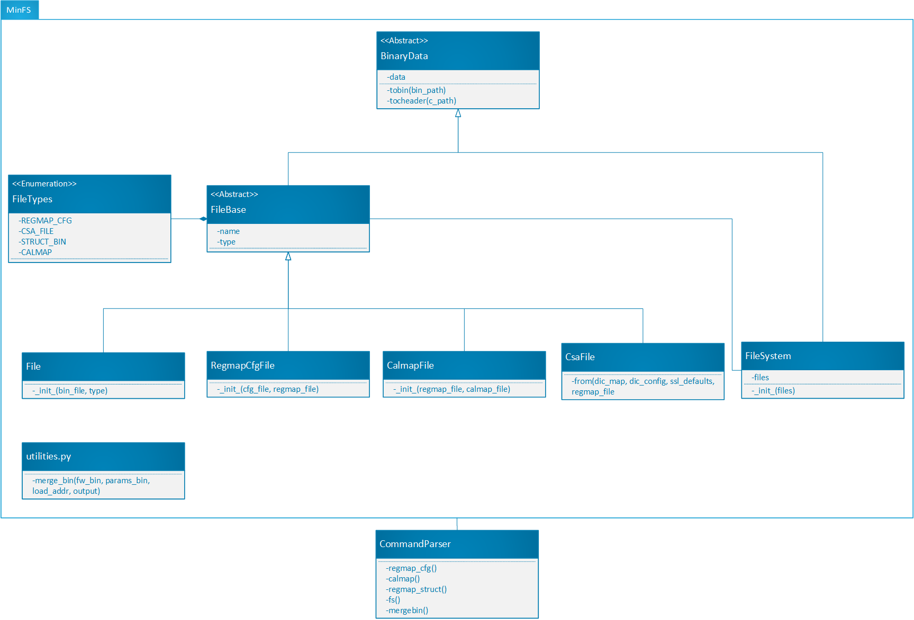

# MinFS for python

This project is designed to be a python wrapper for the C project located here: http://gitlab.cm.local/devops/minfs

This project should provide a python API that can be re-used from other python scripts, but also a command-line tool that can be used by users without any prior
Python knowledge.

## Command-line API

### Create a regmap configuration file
List of arguments:
- `--regmap-cfg-json <json_path>`: Specify json configuration file
  - `<json_path>`: Path to the json configuration file
- `--regmap <regmap_file>`: Path to a .json or .pickle file that can be loaded using the regmap module
- `--compress-regmap <mode>`: Optional. Specify the regmap config file compression mode.
- `-c <c_header_path>`: Optional. Generate a C header file at the specified location.
- `-o <bin_path>`: Optional. Generate a binary file with at the specified location.

```
minfs regmap-cfg --regmap-cfg-json "C:/path/to/regmap-defaults0.json" --regmap "C:/path/to/tzatziki-regmap.json" -o "C:/path/to/defaults0.bin" -c "C:/path/to/defaults0.h"
```

#### Regmap configuration file compression:
The utility for creating regmap configuration files can compile files in 3 different modes:
- `<0>` No compression. Make an entry for each inidividual register in the order specified in the original json file (default).
- `<1>` Contiguous registers result as 1 entry. All entries are sorted by their addresses.
- `<2>` If the distance between two addresses is smaller that the size of an entry header, they result as 1 entry.

```
minfs regmap-cfg --regmap-cfg-json "C:/path/to/regmap-defaults0.json" --regmap "C:/path/to/tzatziki-regmap.json" --compress-regmap 2 -o "C:/path/to/defaults0.bin" -c "C:/path/to/defaults0.h"
```

### Create a calmap file
List of arguments:
- `--calmap-json <json_path>`: Specify calmap json file
  - `<json_path>`: Path to the json calmap file
- `--regmap <regmap_file>`: Path to a .json or .pickle file that can be loaded using the regmap module
- `-c <c_header_path>`: Optional. Generate a C header file from the calmap at the specified location.
- `-o <bin_path>`: Optional. Generate a binary file at the specified location.

```
minfs calmap --calmap-json C:/path/to/calmap_file.json --regmap C:/path/to/tzatziki-regmap.json -c C:/path/to/calmap.h -o C:/path/to/calmap.bin 
```

### Create a packed structure file
List of arguments: 
- `--regmap-struct-json <json_path>`: Specify json structure file.
  - `<json_path>` Path to the json structure file (can be more than one)
- `--regmap <regmap_file>`: Path to a .json or .pickle file that can be loaded using the regmap module.
- `-c <c_header_path>`: Optional. Generate a C header file at the specified location.
- `--struct <name>`: Name of a structure to pack
- `-o <bin_path>`: Optional. Generate a binary file at the specified location.

```
minfs regmap-struct --regmap-struct-json "C:/path/to/config.json" --regmap "C:/path/to/regmap.json" --struct cml_params -o defaults0.bin -c defaults0.h
```

```
minfs regmap-struct --regmap-struct-json "C:/path/to/4wire-params-1.json" "C:/path/to/4wire-params-2.json" --regmap "C:/path/to/regmap.json" --struct cml_params -o defaults0.bin -c defaults0.h
```

### Create a file system
List of arguments:
- `--bin-file <bin_path> <type> <name>`: Optional. Add a binary file to the file system. This argument can be used as many times as necessary. Arguments must be given in this order:
  - `<bin_path>`: Path to the binary to load in the file system
  - `<type>`: Type of the file as defined in FileTypes
  - `<name>`: Optional. Name to be given to the file in the new file system. If no name is provided, use the name of the provided file instead after removing any extension.
- `--regmap-cfg-json <json_path> <name>`: Optional. Create a new regmap configuration file and add it directly to the file system. This argument can be used as many times as necessary. Arguments must be given in this order:
  - `<json_path>`: Path to the json configuration file to load in the file system
  - `<name>`: Optional. Name to be given to the file in the new file system. If no name is provided, use the name of the provided file instead after removing any extension.
- `--compress-regmap <mode>`: Optional. Specify the compression mode of the file specified in `--regmap-cfg-json`. If this argument is used at least once, the compression mode must be specified for every `--regmap-cfg-json`. 
- `--calmap-json <json_path> <name>`: Optional. Create a new calmap file and add it directly to the file system. This argument can be used as many times as necessary. Arguments must be given in this order:
  - `<json_path>`: Path to the json calmap file to load in the file system
  - `<name>`: Optional. Name to be given to the file in the new file system. If no name is provided, use the name of the provided file instead after removing any extension.
- `--regmap-struct-json <json_path>`: Specify json structure file.
  - `<json_path>` Path to the json structure file (can be more than one)
- `--struct <name>`: Name of a structure to pack
- `--regmap <regmap_file>`: Optional. Path to a .json or .pickle file that can be loaded using the regmap module. Required only when provided a regmap configuration file.
- `-c <c_header_path>`: Optional. Generate a C header file at the specified location.
- `-o <bin_path>`: Optional. Generate a binary file with the exntension ".fs.bin" at the specified location.

Examples:
- Create a file system from an existing binary file

```
minfs fs --bin-file "C:/path/to/config0.bin" REGMAP_CFG config0 --bin-file "C:/path/to/config1.bin" REGMAP_CFG config1 -o "C:/path/to/file-system.bin" -c "C:/path/to/file-system.h"
```

- Create a file system using from a regmap configuration json file

```
minfs fs --regmap-cfg-json "C:/path/to/regmap-defaults0.json" config0 --regmap-cfg-json "C:/path/to/regmap-defaults1.json" config1 --regmap  "C:/path/to/regmap.pickle" -o "C:/path/to/file-system.bin" -c "C:/path/to/file-system.h"
```

- Create a file system using from a regmap configuration json file in different comperrsion modes

```
minfs fs --regmap-cfg-json "C:/path/to/regmap-defaults0.json" config0 --compress-regmap 0 --regmap-cfg-json "C:/path/to/regmap-defaults1.json" config1 --compress-regmap 1 --regmap  "C:/path/to/regmap.pickle" -o "C:/path/to/file-system.bin" -c "C:/path/to/file-system.h"
```

- Create a file system using from a calmap json file

```
minfs fs --calmap-json C:/path/to/calmap_file.json calmap0 --regmap C:/path/to/regmap.json -c C:/path/to/calmap.h -o C:/path/to/calmap.bin
```

- Create a file system using from packed structure files

```
minfs fs --regmap-struct-json "C:/path/to/config.json" config0 --regmap  "C:/path/to/regmap.json" --struct cml_params -o "C:/path/to/file-system.bin" -c "C:/path/to/file-system.h"
```

### Merge binary files
This method can be used to merge 2 binaries together, usually an existing Firmware binary and a paremeter file (i.e. file system).

List of arguments:
- `--firmware <bin_path>`: Firmware binary
  - `<bin_path>`: Path to the binary to be loaded in the file system
- `--params <offset> <bin_path>`: Specify the parameter file to merge in the firmware binary.
  - `<offset>`: Load address in the final binary, provided in hexadeximal format. Example: '0x7000'
  - `<bin_path>`: Path to the binary which can be a file system bin, or a regmap configuration file bin.
- `-o <bin_path>`: Generate a binary file at the specified location.

Examples:

```
minfs mergebin --firmware "C:/path/to/firmware.bin" --params 0x7000 "C:/path/to/file-system.bin" -o "C:/path/to/firmware+params.bin"
```

## Python API

### Create a regmap configuration file
```python
from minfs import RegmapCfgFile

# Read json file that contains the regmap defaults using regmap file 
regmap_cfg = RegmapCfgFile("C:/path/to/regmap-defaults0.json", "C:/path/to/tzatziki-regmap.json", "config0")

# Output 
regmap_cfg.tobin("C:/path/to/regmap-defaults0.bin")

regmap_cfg.tocheader("C:/path/to/regmap-defaults0.h")
```

### Create a calibration map file
```python
from minfs import CalmapFile

# Read json file that contains the regmap defaults using regmap file 
calmap_file = CalmapFile("C:/path/to/tzatziki-regmap.json", "C:/path/to/calmap.json", "calmap0")

# Output 
calmap_file.tobin("C:/path/to/calmap.bin")

calmap_file.tocheader("C:/path/to/calmap.h")
```

### Create a file system
```python
from minfs import FileSystem, File, RegmapCfgFile

# Option 1: import a file using an existing binary that was already created using the FileBase.tobin() method
file0 = File("RegmapCfgFile", "C:/path/to/regmap-defaults0.bin")
file0.name = "config0"

# Option 2: Create a file using specific type-specific constructor
file1 = RegmapCfgFile("C:/path/to/regmap-defaults1.json", "C:/path/to/tzatziki-regmap.json")
file1.name = "config1"

# Create a new file system handle
fs = FileSystem([file0, file1])

# Output the file system as a binaru file
fs.tobin("C:/path/to/file-system.bin")

# Output the file system as a c header file
fs.tocheader("C:/path/to/file-system.h")
```

### Merge binary files

```python
import minfs

minfs.merge_bin("C:/path/to/firmware.bin", 0x7000, "C:/path/to/file-system.bin", "C:/path/to/firmware+params.bin")
```

## File formats

### Regmap configuration file
The regmap configuration file uses the json format to describe how the registers should be initialised in a Firmware.
Entries can be defined using the names of the registers flags or states, and requires a regmap file to be interpreted.

The json file has the following properties:
- **format** (int): Specify the format used in this file (currently 1)
- **data** (array): List of regmap entries, each entry can have the following properties:
  - **register** (string): Name of the register
  - **value (double - optional)**: Value to be written.
  - **flags (array<string> - optional)**: List of flag names to be set.
  - **state (string - optional)**: Names of the state to write.

**Examples:**
- Set a register using flag names:
```json
{
  "format" : 1,
  "data":
  [
    {
      "register": "BUT_FEATURES",
      "flags": ["BUT_ENABLE", "BUT_NOTIFY"]
    }
  ]
}
```

- Set a register using the name of a state:
```json
{
  "format" : 1,
  "data":
  [
    {
      "register": "ACTION_EVENTID0",
      "state": "EVENT_BUTTON_DOWN"
    }
  ]
}
```

- Set a register using a value (float or int):
```json
{
  "format" : 1,
  "data":
  [
    {
      "register": "WF_PULSES0",
      "value": 2
    }
  ]
}
```
### Calibration map file
The calibration map file uses the json format to describe how the registers should be read from the calibration buffer.
The calibration map entry type determines how the value extracted from the calibration buffer should be handled.
Certain types specify that the extracted value should be stored in persistent or other firmware registers.
Entries can be defined using the names of the registers, and requires a regmap file to be interpreted.

The json file has the following properties:
- **Persist_Name** (string): the name of the structure in the register map in which parameter values are to be stored.
- **Top_Level_FW_Reg_Name** (string): the name of the structure in the register map in which firware register values are to be stored.
- **version info** (array): version (compatibility) infomation of this calibration map
  - **map ver** (int): map version of the calibration map
- **calibration_params** (array): List of calibration map entries, each entry can have the following properties:
  - **name** (array): Name of the calibration map entry
    - **type** (int): Type enumeration indicating, to the firmware, how this value in the calibration buffer should be handled.
    - **bytes** (int): Number of bytes this entry's data comprises.
    - **valid_flag_offset** (int): Offset (in bytes) of the location at which the validity flag for this entry resides in the calibration buffer.
    - **offset_in_cal_buffer** (int): Offset (in bytes) of the location at which the data for this entry resides in the calibration buffer.

**Examples:**
```json
{
    "Persist_Name": [
        "params_struct_name"
    ],
    "Top_Level_FW_Reg_Name": [
        "fw_register_struct_name"
    ],
    "version info": {
        "map ver": 1
    },
    "calibration_params":{
        "REGISTER0": {
            "type": 0,
            "bytes": 4,
            "valid_flag_offset": 0,
            "offset_in_cal_buffer": 1
        },
        "ACTUATOR_VALUE": {
            "type": 1,
            "bytes": 2,
            "valid_flag_offset": 5,
            "offset_in_cal_buffer": 6
        },
        "CAMERA_BUILD_VALUE": {
            "type": 2,
            "bytes": 2,
            "valid_flag_offset": 8,
            "offset_in_cal_buffer": 9
        },
        "PARAMETER0": {
            "type": 3,
            "bytes": 2,
            "valid_flag_offset": 11,
            "offset_in_cal_buffer": 12
        },
        "STORED_REGISTER": {
            "type": 4,
            "bytes": 2,
            "valid_flag_offset": 14,
            "offset_in_cal_buffer": 15
        }
    }
}
```

### SSL config file
The regmap structure packing feature uses SSL config file format from [CSA Param File Maker](http://gitlab.cm.local/devops/csa_param_file_maker).
It ignores `Persist_Name` property because the structure name must provided manually using `--struct` argument.

## Code design
- **FileBase**: This is a base abtract class that defines the interface that a File needs to implement so it can be added to a file system (name, type, data...).
- **File**: This class can be used to load a binary file that can then be added to a file system.
- **RegmapCfgFile**: This class creates a regmap configuration file using a regmap configuration json, that can then be added to a file system.
- **CalmapFile**: This class creates a calibration map file using a regmap configuration json, that can then be added to a file system.
- **CsaFile**: This class creates a csa file using csa json definition files, that can then be added to a file system.
- **utilities.py**: This module provides the mergebin function, which can be used to merge a firmware binary with a parameter file binary (i.e. file system).
- **CommandParser**: This class is responsible for parsing the command-line arguments for the command-line API. command_parser.py also implements the entry-point for the command-line cli.


